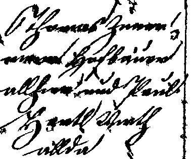
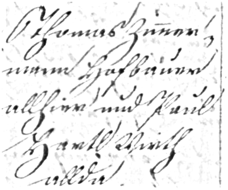
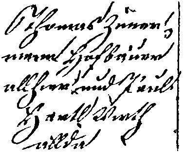

# Binarization Tool

## Visual Computing Group (VCG) 
## Democritus University of Thrace (DUTH)

In the frame of “READ” project a binarisation method was adopted from 
the “tranScriptorium” project. The modifications include the merge of the three
different basic variations (Default, Bleed-through and Faint characters’) into a 
single generic mode along with further optimizations with respect to the selection of various thresholds. 

The binarisation method is developed in C++11 and is available at github under LGPL-3.0:

Original Document | Binarization
-------------------------------|--------------------------
 | 

Enhancement | Binarisation after enhancement
-------------------------------|--------------------------
 | 

*Usage:* binarization [infile] [outfile]

Go [here](https://github.com/Transkribus/VCG-DUTH-Enhancement) for the Enhancement Code:  
